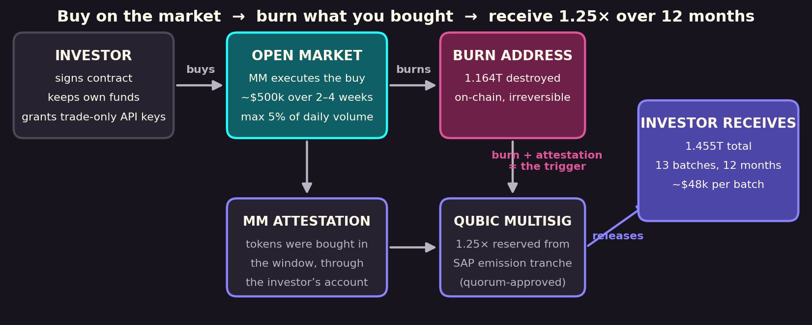
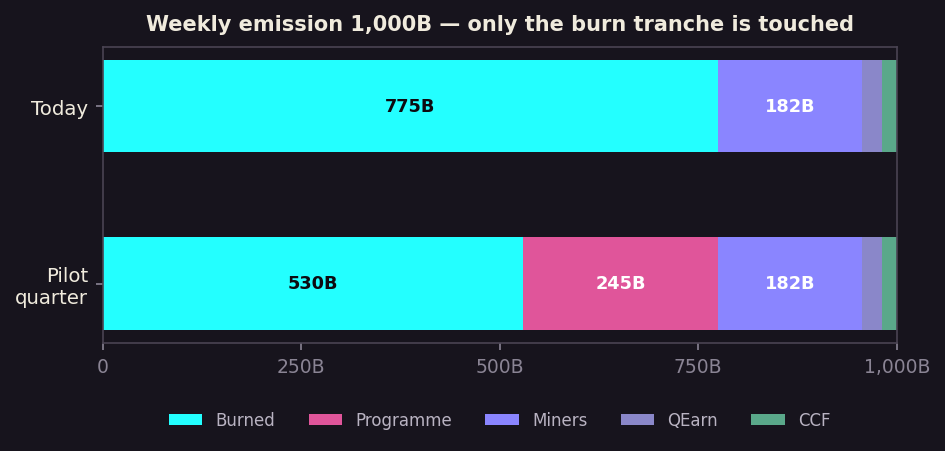
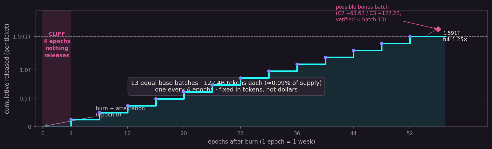
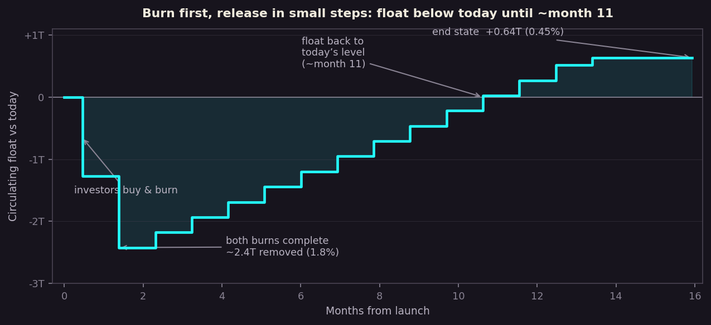

# 🌐Investors Pilot Model Proposal

## Proposal

Allow a **temporary adjustment of the Computor Donation to the SupplyWatcher (burn)**: for **15 epochs (14 nominal + 1 buffer)**, redirect **24.5%** from the burn tranche into a dedicated programme multisig (3-of-5, published before launch) that funds the **Investors Pilot Model** — a programme in which outside investors **buy QUBIC on the open market, burn what they bought, and receive 1.25× the burned amount released in small batches over 12 months**.
Because donations are a **percentage of what Computors actually earn**, all token figures in this document are **ceilings** — actual accrual is normally lower. The window is closed by a **paired restore proposal (Proposal B), published simultaneously with this one**, which returns the burn donation to 77.5%. Nothing else in the emission split changes.

---

## 🗳️ Voting Options

> **Option 0:** No, I don't want

> **Option 1:** Yes, redirect 24.5% of Computor earnings from the burn donation to the programme multisig for a 14-epoch window

---

## Summary

Qubic needs outside capital, and every conventional route ends the same way: the protocol sells tokens into a thin order book, and the market watches it happen. This proposal funds the opposite motion. The investor's money **buys QUBIC on the open market** (executed by our market maker through the investor's own account — their funds never touch Qubic), the bought tokens are **burned at the burn address**, and the investor is repaid **1.25 tokens per token burned** from emission that would have been burned anyway — released in 13 small batches over twelve months, each batch conditional on the investor's continued compliance.

Qubic sells nothing, holds no investor money, and pays only for **verified buying**. The entire cost of the pilot is **0.64T net new supply (0.45% of circulating)** — published, capped, and voted here before any investor is approached.

**Every ticket hits the price from both sides at once.** The investor's ~$500k is real buy pressure on the open market (demand up), and the bought tokens are then immediately and verifiably burned (supply down) — a double effect delivered up front, while the 1.25× repayment is deferred, dripped, and conditional. No other funding route gives the network demand and a burn from the same dollar.

---

## Why this is being proposed

- **~6 months of CCF runway.** Treasury inflow fell 65% at the Epoch 227 halving; approved spend now exceeds quarterly inflow.
- **A treasury sale is the worst option.** It adds supply, drains the CCF, and signals that the protocol is selling to survive — on ~$0.73M/day of volume, everyone would see it.
- **This model turns raises into demand.** Every ticket becomes ~$500k of verified open-market buying before Qubic issues anything back.

---

## How the model works

1. **Contract** — an approved investor signs the full package: attestation requirement, no-hedging covenant, mandatory ecosystem commitments (C1). *No contract → no ratio.*
2. **Buy** — ~$500k per ticket executed by the Qubic market maker through the investor's own account, inside a defined window. *No attestation → no ratio: burning an old bag earns nothing.*
3. **Burn** — the bought tokens are destroyed at the burn address **immediately after purchase**. On-chain, irreversible, verifiable by anyone. Combined with step 2, this is the model's double effect: market buying lifts demand and the burn cuts float in the same motion, before a single token is issued back.
4. **Release** — 1.25× the burned amount is released from the multisig in 13 equal batches over 12 months (schedule below).

---

## What this vote changes — and what it does not

| Weekly emission: 1,000B nominal | Share today | During the pilot window (14 epochs) |
|---|---|---|
| **Burned (SupplyWatcher)** | 77.5% (max 775B) | **53.0% still burned + 24.5% to the programme multisig (max 245B)** |
| Miners | 181.6B (18.2%) | **Untouched** |
| QEarn | 25.4B (2.5%) | **Untouched** |
| CCF (treasury) | 18.0B (1.8%) | **Untouched** |

- The draw is **32% of the burn donation at most**. The window runs **15 epochs (14 nominal + 1 buffer)** — sized to the programme's **maximum possible obligation including bonuses (3.44T)**, not its base case, with actual-earnings variance absorbed by the buffer. The window is closed by the paired restore proposal, not by code — **no core code changes are required anywhere in this model**.
- Supply cap, miner rewards, QEarn and CCF are not part of this vote.

### Funding coverage — the window covers every scenario

| Scenario (2 tickets) | Multiplier | Tokens owed | Covered by the 3.675T ceiling |
|---|---|---|---|
| No investor signs | — | 0 | Everything accrued is burned |
| Base only | 1.25× | 3.18T | Yes — 0.49T spare → burned |
| Both tickets earn C2 | 1.30× | 3.31T | Yes — 0.37T spare → burned |
| One C2, one C3 | 1.30× / 1.35× | 3.37T | Yes — 0.30T spare → burned |
| Both tickets earn C3 (maximum) | 1.35× | 3.44T | Yes — 0.24T spare (~7% variance margin) → burned |

Per ticket: burn ~1.272T (~$500k at ref price); base repayment 1.591T in 13 batches of ~122.4B; **C2 bonus (+5%) = 63.6B; C3 bonus (+10%) = 127.2B**. Bonuses are additive to the multiplier (1.25× → 1.30× or 1.35×) and **do not stack** — a ticket earns C2 or C3, never both. A bonus is released as **one additional batch** at the next scheduled release point after delivery is verified, under the same accrual rule and compliance check as every base batch; **verification no later than the final base batch (batch 13)**. Nothing is released early, and nothing is released that has not accrued.
- **Burn-back rule — anything not earned goes to the burn address.** Tokens accrued to the programme multisig are used only to serve signed ticket schedules and verified bonuses; everything else is burned publicly, with transaction hashes published: **if no investor signs**, 100% of accrued tokens are burned at window close (net cost to the network: zero); **at window close (end of epoch 15)**, everything beyond the remaining scheduled base batches plus a reserve for still-eligible bonuses is burned; **at programme close (after batch 13)**, any bonus reserve not earned or not verified in time is burned — nothing is redistributed, rolled over or retained; **on covenant breach**, all unreleased batches for that ticket, base and bonus, are forfeited and burned. The programme multisig holds nothing after programme close.
- Precedent: this is the same decision class as the QEarn emission reallocation (Nov 2024) and the SupplyWatcher halving adjustments (Epochs 175 / 227).

---

## The release mechanism

- **Nothing is unlocked up front.** The full 1.25× accrues to the programme multisig.
- **Cliff:** first release 4 epochs after burn + attestation.
- **Then 13 equal batches**, one every 4 epochs — **~122.4B tokens each, ≈0.09% of circulating supply per batch**. The schedule is fixed in tokens, not dollars: at the reference price a batch is worth ~$48k; if the price rises, the dollar value rises with it — but each batch stays the same sliver of supply, and rising prices historically come with deeper traded volume. Either way, there is never a block to sell.
- **Custody and control:** the programme multisig is operated under a **3-of-5 signatory structure, finalised and published in full before launch**, with the option of one investor-representative signatory for transparency. All addresses are published in this document before launch; every release is verifiable on-chain against the schedule.
- **Every batch is conditional:** the no-hedging covenant and the C1 ecosystem commitments are checked before each release — thirteen times, not once at signing.
- **Breach forfeits every unreleased batch.** Forfeited tokens are never minted, so a breach leaves the supply tighter than if the investor had complied.

---

## Impact on the 200T supply cap

The cap itself is untouched — this vote changes only the pace of approach. Remaining headroom today is **57.79T** (200T − 142.21T outstanding).

| At full pilot uptake | Value |
|---|---|
| Net new supply (maximum) | **0.64T** |
| Share of remaining headroom | **1.10%** |
| Runway consumed (at 225B/epoch effective emission) | **~2.8 epochs (~3 weeks of a ~5-year path)** |
| If no investor signs | **0** |
| If an investor breaches | **below 0.64T** (forfeited batches are never minted) |

The burn is front-loaded, so for the first ~2 months supply moves *away* from the cap before releases catch up. Under Supply Watcher equilibrium (~196.8T by ~Epoch 591) the 200T cap is not expected to be reached at all; a one-off 0.64T is absorbed by the dynamic burn adjustment.

---

## Pilot scale and net effect

| | Amount | % of circulating (142.21T) |
|---|---|---|
| Tickets (max 2 per investor) | 2 | — |
| Bought on market & burned | 2.55T | 1.79% |
| Issued back over 12 months (base) | 3.18T | 2.24% |
| Issued back, absolute max (all C3 bonuses) | 3.44T | 2.42% |
| **Net new supply — base / max** | **0.64T / 0.89T** | **0.45% / 0.63%** |

Burning is front-loaded (float drops ~2.3T inside two months); releases are back-loaded (float does not return to today's level until ~month 11). A treasury sale of the same scale would add 3.18T from day one with nothing burned.

---

## Guardrails

1. **Contract gate** — only a signed investor earns the ratio; anyone else who burns has donated to the burn.
2. **Attestation gate** — the ratio is paid only for tokens the market maker attests were bought through the investor's account during the window.
3. **No-hedging covenant** — no shorts, perpetuals or equivalents for the full release period; breach forfeits all unreleased batches.
4. **Qubic holds the tokens** — releases come batch by batch from the multisig; on breach, releases simply stop.
5. **Releases too small to dump** — each batch is ≈0.09% of circulating supply (~$48k at the reference price; the token amount never changes, whatever the price does).
6. **Published before launch** — full terms and all addresses public (this document) before any investor is approached.

---
## Sequencing and considerations

- **No investor is approached, promised or signed until this vote passes.** The quorum's decision comes first.
- **Signed contracts are honored — by everyone, including the quorum.** During the 13 epochs the tranche accrues to the programme multisig; once an investor has bought, burned and been attested under an approved tranche, their release schedule is served from tokens already accrued and is **not subject to retroactive change**. Governance keeps full authority over the *future* — any adjustment or termination proposal applies only to tickets not yet signed. This ring-fencing is what makes the model bankable to a serious counterparty: Qubic's word, once given on-chain, holds.
- **No core code changes are required.** The redirect and restore are standard donation-split votes (the mechanism already running QEarn and the burn); releases are ordinary multisig transfers on a published schedule; verification is off-chain tooling. The programme team publishes a per-epoch accrual dashboard so actuals vs the ceiling are checkable all window long.
- The pilot is judged on four public tests (quorum approval; a real investor signing the full undiluted package; one complete buy→burn→attest→release cycle on schedule; delivered marketing/partnership commitments). **Fail any one and the full programme does not proceed.**
- If no investor signs, the restore proposal closes the window at epoch 15 and **everything accrued is burned — no tokens are issued and the network has lost nothing**. Administrative and legal setup costs are outside the scope of this vote and will be requested separately if and when they arise (unforeseen costs excluded here).

---

## Disclaimer

This proposal redirects part of the burn donation for a fixed window closed by a paired restore vote. It creates 0.64T of net new supply at full pilot uptake and 0 if no investor signs. It is not an offer to any investor, makes no representation about future price, and nothing is owed to any party unless the quorum approves this vote and a contract is subsequently signed — after which signed obligations are honored in full as described above. All figures use market data verified 15 Sep 2026 (price $0.000000393, mcap $55.9M, circulating 142.21T) as a reference only; the deal itself is denominated in tokens and does not depend on price.

---

*Submitted by BD lead-Kimz — BD lead,  Full detail: [here](Qubic_Inv_Computor_Deck_Final.pdf)
