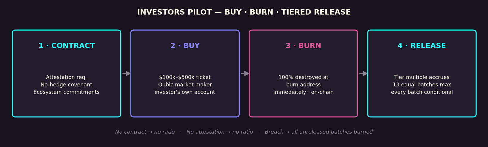
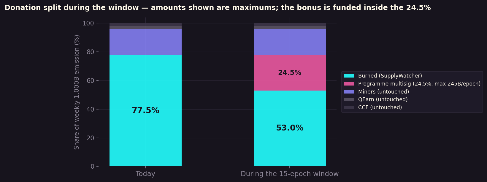
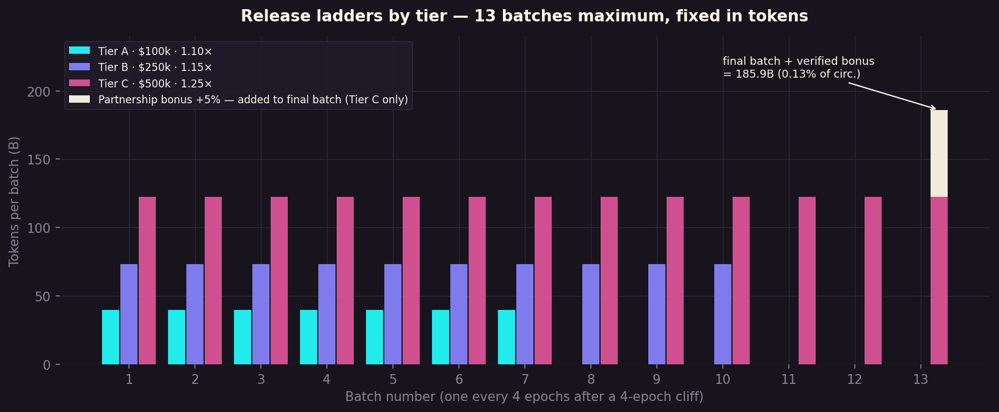
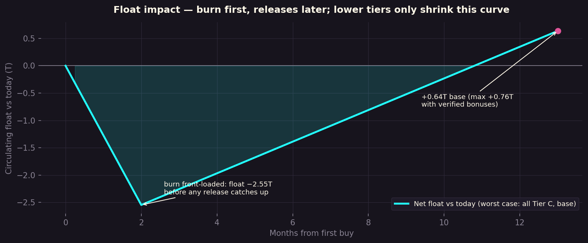

# 🌐Investors Pilot Model Proposal

## Proposal

Allow a **temporary adjustment of the Computor Donation to the SupplyWatcher (burn)**: for **15 epochs (14 nominal + 1 buffer)**, redirect **24.5%** from the burn tranche into a dedicated programme multisig (3-of-5, published before launch) that funds the **Investors Pilot Model** — outside investors **buy QUBIC on the open market, burn what they bought, and receive a tiered multiple of the burned amount in up to 13 small batches**.
Donations are a **percentage of what Computors actually earn**, so all token figures are **ceilings**. The window is closed by a **paired restore proposal (Proposal B)** — text in the annex below, submitted immediately upon approval of this vote — returning the burn donation to 77.5%. Nothing else in the emission split changes.

*Full mechanics, charts and scenario tables: [briefing deck (PDF)](Qubic_Computor_Deck_v7.pdf).*

---

## 🗳️ Voting Options

> **Option 0:** No, I don't want

> **Option 1:** Yes, redirect 24.5% of Computor earnings from the burn donation to the programme multisig for a 15-epoch window

> **Wallet address:** QGYUCOVCPEDXEEAEHETDEKXXNYADKBZFDBLXAKPUOAGHRRYOIPCCCGJFTLEA

---

## Summary

Every conventional way to raise outside capital ends with the protocol selling tokens into a thin order book. This proposal funds the opposite motion: the investor's money **buys QUBIC on the open market** (executed by our market maker through the investor's own account — their funds never touch Qubic), the bought tokens are **burned immediately**, and the investor is repaid a **tiered multiple** from emission that would have been burned anyway — dripped, conditional, and fixed in tokens.

**Every ticket hits the price from both sides at once**: real buy pressure up front, a verified burn right behind it, repayment deferred. Qubic sells nothing, holds no investor money, and pays only for verified buying. The programme is capped at **$1M of committed capital / 3.31T of token obligation**; its cost at the worst composition is **0.64T net new supply (0.45% of circulating), 0.76T with the bonus (0.54%)**. If no investor signs, everything accrued is burned — **zero cost**.

---

## Why this is being proposed

- **~6 months of CCF runway.** Treasury inflow fell 65% at the Epoch 227 halving; approved spend now exceeds quarterly inflow.
- **A treasury sale is the worst option.** It adds supply, drains the CCF, and signals that the protocol is selling to survive — on ~$0.73M/day of volume, everyone would see it.
- **This model turns raises into demand.** Every ticket becomes verified open-market buying before Qubic issues anything back.

---

## How it works

1. **Contract** — an approved, KYC/sanctions-screened legal entity signs the full package: attestation requirement, holdings declaration, no-hedging and no-disposal covenants, mandatory ecosystem commitments (C1). *No contract → no ratio.*
2. **Pre-fund** — a ticket executes **only once its full repayment has already accrued in the programme multisig**. Every signed schedule is 100% funded before the first token is bought.
3. **Buy** — executed by the Qubic market maker through the investor's own account, inside a defined window, at **≤10% of trailing 7-day volume**. *No attestation → no ratio: burning an old bag earns nothing.*
4. **Burn** — bought tokens destroyed at the burn address immediately. On-chain, irreversible.
5. **Release** — the tier multiple is released in equal batches, one every 4 epochs after a 4-epoch cliff, every batch conditional on compliance.

### Ticket tiers

| Tier | Ticket (ref.) | Multiple | Gain | Batches | Release period |
|---|---|---|---|---|---|
| **A** | $100,000 | **1.10×** | +10% | 7 | ~6 months |
| **B** | $250,000 | **1.15×** | +15% | 10 | ~9 months |
| **C** | $500,000 | **1.25×** | +25% | 13 | 12 months |

Per ticket, at the reference price: **Tier A** burns ~254.5B and repays 279.9B in **7 batches of ~40.0B**; **Tier B** burns ~636.1B and repays 731.6B in **10 batches of ~73.2B**; **Tier C** burns ~1.272T and repays 1.590T in **13 batches of ~122.3B**. Every batch at every tier is **0.03%–0.09% of circulating supply**, fixed in tokens. Every tier passes the **identical** contract, attestation, covenant and per-batch compliance gates — the guardrails do not scale down with the cheque.

- **Caps — in tokens, not dollars.** The programme's total token obligation is capped at **3.31T** (the all-Tier-C-with-bonus case at the reference price); dollar ticket sizes are references at $0.000000393, and each ticket's token size is **fixed at execution within that cap**. If price falls, tickets shrink in dollars and the ceiling is never breached; if price rises, less is owed and the surplus is burned. Programme: **$1M reference / 3.31T hard cap · max 6 tickets**. Per investor: **up to $1M reference in any combination of tiers**, each additional ticket **only after the previous one completes buy → burn → attestation on schedule**. One qualified legal entity per ticket — no pooled, nominee or syndicate structures. Tickets are allocated at signing; if demand competes, larger tickets allocate first, then signing order.
- **Signing window.** Tickets sign and execute only against accrued balance; the signing window closes when the accrued balance can no longer fully pre-fund a further ticket, and in any case at the end of epoch 15. At the 245B/epoch ceiling, a first Tier C ticket is fully pre-funded by ~epoch 7 and a second by ~epoch 13.
- The rate attaches to the **ticket**, so splitting a commitment into smaller tickets only earns a lower rate — fragmentation penalises itself.
- **Partnership bonus — Tier C only, +5%** (1.25× → 1.30×, ~63.6B) for one **verified** major deliverable (tier-1 listing, live partnership, or delivered campaign), one deliverable per ticket. The bonus is **added to the final batch** (~185.9B when earned, ~0.13% of circulating) — the batch count never grows and the timeline never extends — and it is **funded from within the same 24.5% tranche**: it never increases the draw. Verification by the multisig signers against published evidence, **no later than the final base batch**; unverified → the reserve is burned.

---

## What this vote changes — and what it does not

| Weekly emission: 1,000B nominal | Share today | During the window (15 epochs) |
|---|---|---|
| **Burned (SupplyWatcher)** | 77.5% (max 775B) | **53.0% burned + 24.5% to programme multisig (max 245B)** |
| Miners / QEarn / CCF | 18.2% / 2.5% / 1.8% | **Untouched** |

- The draw is **at most 32% of the burn donation**. The window runs **15 epochs, counted from the first epoch the new routing entry is live**, and is sized to the **maximum possible obligation including the partnership bonus: 3.31T owed vs 3.675T ceiling (~11% margin)**. The worst accrual week observed on-chain (95.6% of ceiling) still accrues ~3.51T over 15 epochs. Any mix with Tier A/B tickets costs strictly less — $1M as 4 × Tier B owes 2.93T and costs 0.38T net.
- **Routing-table mechanics (GQMPROP).** Entries apply sequentially, each taking its share of what remains, and new entries append after existing ones. The burn entry is set to **530,000 millionths** of revenue (53.0%); the programme entry, applied to the remainder, to **521,277 millionths** (= 24.5% of gross). Exact values are confirmed with core devs against the live table order before submission. **No core code changes anywhere in the model.**
- **Burn-back rule — anything not earned goes to the burn address.** Tokens accrued to the programme multisig serve only signed ticket schedules and verified bonuses; everything else is burned publicly, with transaction hashes published: **if no investor signs**, 100% of accrued tokens are burned at window close (net cost to the network: zero); **at window close (end of epoch 15)**, everything beyond the remaining scheduled batches plus a reserve for still-eligible bonuses is burned; **at programme close (after each ticket's final batch)**, any bonus reserve not earned or not verified in time is burned — nothing is redistributed, rolled over or retained; **on covenant breach**, all unreleased batches for that ticket, base and bonus, are forfeited and burned. The programme multisig holds nothing after programme close.
- Precedent: this is the same decision class as the QEarn emission reallocation (Nov 2024) and the SupplyWatcher halving adjustments (Epochs 175 / 227).

---

## The release mechanism

- **Nothing is unlocked up front.** The full tier multiple sits pre-funded in the programme multisig before the burn.
- **Cliff:** first release 4 epochs after burn + attestation, at every tier. **Then equal batches, one every 4 epochs** — 7, 10 or 13 by tier. The schedule is fixed in tokens, not dollars: if the price rises, the dollar value rises with it, but each batch stays the same sliver of supply. There is never a block to sell.
- **Every batch is conditional:** the no-hedging and no-disposal covenants and the C1 commitments are checked before each release — at every batch, not once at signing. **Breach forfeits every unreleased batch**; forfeited tokens are never minted, so a breach leaves the supply tighter than if the investor had complied.
- **Custody and control:** the programme multisig operates under a **3-of-5 signatory structure, finalised and published in full before launch**, with the option of one investor-representative signatory. Breach and bonus determinations are made by signer majority on published evidence, with the investor given the opportunity to respond before any forfeiture. Every release is verifiable on-chain against the schedule.
  - Signer 1 — Kimz
  - Signer 2 — Joetom
  - Signer 3 — Spikeinjapan
  - Signers 4 and 5 slots for investors

---

## Cost to the network

| Worst-case composition (all Tier C) | Amount | % of circulating (142.21T) |
|---|---|---|
| Bought on market & burned | 2.55T | 1.79% |
| Issued back (base / absolute max with bonus) | 3.18T / 3.31T | 2.24% / 2.33% |
| **Net new supply (base / absolute max)** | **0.64T / 0.76T** | **0.45% / 0.54%** |
| If filled at lower tiers | as low as 0.38T | 0.27% |
| If an investor breaches | below the figures above (forfeits are never minted) | — |
| If no investor signs | 0 | 0 |

The 200T cap itself is untouched — this vote changes only the pace of approach. Remaining headroom is **57.79T** (200T − 142.21T); the worst case consumes **1.1% of it, ~2.8 epochs (~3 weeks) of a ~5-year path**, and equals **~0.8 epochs of normal burn** at the 775B ceiling. The burn is front-loaded and the releases are back-loaded. A treasury sale of the same scale would add 3.18T on day one with nothing burned.

---

## Guardrails

1. **Contract gate** — only a signed, KYC/sanctions-screened legal entity earns the ratio; anyone else who burns has donated to the burn.
2. **Pre-funding gate** — no ticket executes until its full repayment has accrued in the multisig; no signed schedule can ever be stranded, by any vote.
3. **Attestation gate** — paid only for tokens the market maker attests were bought through the investor's account in the window, with a counterparty-concentration attestation (no single counterparty on the other side).
4. **Execution cap** — purchases at ≤10% of trailing 7-day volume, attested per tranche.
5. **No-hedging and no-disposal covenants** — no shorts, perpetuals or equivalents, and no sale of declared pre-existing holdings, for the full release period; breach forfeits all unreleased batches.
6. **Qubic holds the tokens** — batch-by-batch from the multisig; on breach, releases stop.
7. **Identical gates at every tier** — a smaller ticket earns a smaller ratio, never a lighter process.
8. **Published before launch** — full terms, the contracting entity, and all addresses public before any investor is approached.

---

## Sequencing

- **No investor is approached, promised or signed until this vote passes.**
- **Signed contracts are honored — by everyone, including the quorum — by construction.** During the 15-epoch window the tranche accrues; a ticket executes only against tokens already accrued, so every signed schedule is served from a balance the multisig already holds and is not subject to retroactive change. Governance keeps full authority over tickets not yet signed.
- **No core code changes.** The redirect and restore are standard donation-split votes; releases are ordinary multisig transfers on a published schedule; verification is off-chain tooling. The programme team publishes a per-epoch accrual dashboard and a per-batch compliance report.
- The pilot is judged on four public tests (quorum approval; a real investor signing the undiluted package; one complete pre-fund→buy→burn→attest→release cycle on schedule; delivered commitments). **Fail any one and the programme does not proceed.** Admin/legal costs are out of scope — requested separately if they arise.

---

## Annex — Proposal B (restore), submitted upon approval of this vote

> **Restore the SupplyWatcher burn donation to 77.5% of Computor earnings and set the programme-multisig donation to 0, effective at the close of the 15-epoch window.** Both entries are scheduled by `firstEpoch` so the restore is on the record before the window opens. Until Proposal B is live, the burn-back rule applies every epoch: anything accrued beyond signed obligations is burned publicly, so the network's exposure is identical to a restore.

---

## Disclaimer

This proposal redirects part of the burn donation for a fixed window closed by a paired restore vote. It creates at most 0.64T net new supply at the worst-case base composition (0.76T absolute max with the bonus), less at any other composition, and 0 if no investor signs. It is not an offer to any investor and makes no representation about future price; nothing is owed unless the quorum approves this vote and a contract is subsequently signed — after which signed obligations are honored in full. Figures reference market data of 15 Sep 2026 (price $0.000000393, circulating 142.21T); the deal is denominated in tokens and does not depend on price.

---

*Submitted by Kimz — BD lead · Full detail: [briefing deck (PDF)](Qubic_Computor_Deck_v7.pdf)*
